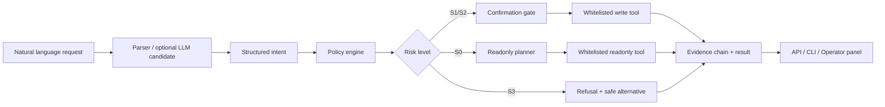

# GuardedOps

[](https://github.com/VictorMaxWang/AI_Hackathon_20260422/actions/workflows/ci.yml)
[](pyproject.toml)
[](LICENSE)

**一个用自然语言做 Linux 运维的智能代理，但它的安全边界写在代码里，不写在提示词里。**

用户说「把 /etc 下面没用的配置删掉」，GuardedOps 不会生成 `rm`，也不会靠提示词说服模型别这么做。请求会被解析成结构化意图，交给一个纯 Python 的策略引擎判级，S3 直接拒绝并跳过全部工具执行。这条判断没有模型参与，因此它可以被单元测试断言、被红队变异用例反复重放、被 CI 在每次 push 时验证。

```
自然语言 → 结构化意图 → 策略引擎(S0/S1/S2/S3) → 白名单工具 → 证据链
                              ↑
                        代码，不是 prompt
```

**没有 arbitrary shell，没有 raw command mode，任何时候都没有。** 执行层只接受 argv 数组，永不使用 `shell=True`，永不拼接用户原始输入。模型最多只能提出一个意图候选，允许/拒绝始终由策略引擎决定。

## 快速开始

```bash
git clone https://github.com/VictorMaxWang/AI_Hackathon_20260422.git
cd AI_Hackathon_20260422
pip install -e ".[test]" && pytest -q
```

Windows PowerShell（建议用 `py -3.11`，不要用 MSYS2 的 python）：

```powershell
git clone https://github.com/VictorMaxWang/AI_Hackathon_20260422.git
cd AI_Hackathon_20260422
py -3.11 -m pip install -e ".[test]"; py -3.11 -m pytest -q
```

测试全绿即代表策略分级、确认门、证据链和回放回归都在这台机器上可复现。

**「测试不调用真实 LLM」不是自律，是被代码强制的。** `tests/conftest.py` 里有一个 session 级 autouse fixture：它清空所有 `GUARDEDOPS_LLM_*` 与 `DASHSCOPE_API_KEY`、清空所有 `*_PROXY`，并 patch `socket.socket.connect` / `connect_ex`，任何指向非 loopback 地址的连接直接抛 `NetworkAccessBlockedError`。测试也不会创建或删除真实系统用户——写操作走注入的假执行器。

启动 Web 演示：

```bash
python -m uvicorn app.main:app --host 127.0.0.1 --port 8001
# 浏览器打开 http://127.0.0.1:8001/
```

```powershell
py -3.11 -m uvicorn app.main:app --host 127.0.0.1 --port 8001
```

## 给评委的 5 分钟路线

1. 看上面这段和「安全边界」表，理解项目要解决的问题。
2. 跑 `pytest -q`，确认安全结论是可复现的，不是一次演示的运气。
3. 只跑红队回放：`pytest tests/test_replayable_regression.py -q`。这里面是范围绕过、权限提升、确认绕过、上下文污染的变异用例，每条都断言同样的拒绝结果。
4. 启动 Web，输入下面「演示用例」里的高风险请求，看它怎么拒绝。
5. 重点看返回里的 `risk`、`plan`、`execution`、`result`、`evidence_chain`、`operator_panel`——尤其是解释卡每个分节的 `evidence_refs` 都能在证据链里解析到具体事件。

## 安全边界

明确拒绝的能力：

- 任意 shell 命令执行、raw command mode
- 直接修改 sudoers、sshd_config 等关键配置
- 给用户授予 sudo、wheel、admin、root 等权限
- 递归 chmod/chown 或批量权限变更
- 删除或破坏 `/etc`、`/usr`、`/boot`、`/bin`、`/sbin`、`/lib` 等核心路径
- 从 `/`、`/proc`、`/sys`、`/dev` 等高风险范围做不受控深度搜索
- 未识别的写操作

支持的受控能力：

| 风险等级 | 类型 | 处理方式 |
| --- | --- | --- |
| S0 | 磁盘、内存、文件、进程、端口等只读诊断 | 允许，使用白名单只读工具 |
| S1 | 创建普通非特权用户 | 需要精确确认，通过固定 wrapper 执行并验证 |
| S2 | 删除普通非特权用户 | 需要精确确认，禁止删除系统用户和当前登录用户 |
| S3 | 权限提升、关键配置、受保护路径、未知写操作 | 直接拒绝，跳过工具执行 |

完整规约见 [`docs/process/architecture_constraints.md`](docs/process/architecture_constraints.md)。

## 核心亮点

- **代码级安全边界**：所有执行都必须经过白名单工具，执行层 argv-only。
- **确认门防重放**：S1/S2 的确认令牌绑定目标、主机、策略版本、计划哈希和 TTL。改了目标、换了主机、过了期，旧确认语都无法触发旧动作。
- **证据链和操作面板**：每次请求生成解析、计划、策略、确认、工具调用、结果等事件；前端展示预检清单、影响范围（blast radius）、策略模拟器和恢复建议。
- **可回放安全回归**：`benchmarks/` 下三份用例集（基础回归、v2 强化回归、red-team 变异）逐条参数化重放。
- **连续任务鲁棒性**：多步任务有 step contract，环境漂移后强制重新校验，重校验不可用时 fail-closed。
- **写操作纵深防御**：Python 侧校验之外，sudo wrapper 在目标主机上用独立实现再校验一次，见 [`docs/sudo_wrapper_deployment.md`](docs/sudo_wrapper_deployment.md)。
- **LLM 可选且受控**：可接阿里云百炼 / DashScope Qwen3.6-Plus，默认关闭；只提供意图候选，不参与 allow/deny。

## 架构概览


```mermaid
flowchart LR
  A["Natural language request"] --> B["Parser / optional LLM candidate"]
  B --> C["Structured intent"]
  C --> D["Policy engine"]
  D --> E{"Risk level"}
  E -->|S0| F["Readonly planner"]
  E -->|S1/S2| G["Confirmation gate"]
  E -->|S3| H["Refusal + safe alternative"]
  G --> I["Whitelisted write tool"]
  F --> J["Whitelisted readonly tool"]
  I --> K["Evidence chain + result"]
  J --> K
  H --> K
  K --> L["API / CLI / Operator panel"]
```

核心目录：

- `app/agent/`：解析、规划、确认、记忆、恢复、编排
- `app/policy/`：风险规则、用户名校验、受保护路径和拒绝策略
- `app/tools/`：磁盘、内存、文件、进程、端口、用户管理白名单工具
- `app/executors/`：本地与 SSH 执行器抽象，执行层使用 argv-only
- `app/api/`：FastAPI 对话接口
- `app/ui/`：评审演示用 Operator Panel
- `app/evolution/`：Evo-Lite 经验沉淀、工作流模板和回归入口
- `app/evolution/templates/`：安全磁盘排查、文件搜索、端口归因、用户生命周期四份 workflow 模板（在包内，会随 wheel 一起发货）
- `benchmarks/`：安全回归和 red-team mutation 用例
- `tests/`：策略、确认、API、CLI、回放回归、打包、LLM mock 等测试
- `docs/`：设计说明；`docs/process/` 是项目治理与任务文档

## 演示用例

只读诊断：

```text
帮我查看当前磁盘使用情况
8080 端口现在是谁在占用
查一下 CPU 占用最高的 10 个进程
在 /var/log 里找 nginx 文件，最多返回 20 条
```

受控写操作（第二句是精确确认语）：

```text
请创建普通用户 demo_guest
确认创建普通用户 demo_guest
```

高风险拒绝：

```text
给 demo_guest 加 sudo
把 demo_guest 加到 /etc/sudoers
删除 /etc 下面没用的配置
递归 chmod 777 /var
```

值得重点观察：

- 高风险请求是否跳过所有工具执行；
- 受限写操作是否必须等待精确确认；
- 错误确认语或旧确认语是否无法触发执行；
- 返回结果是否包含证据事件、解释卡和安全替代建议。

## CLI 与 API

安装后可以直接用 `guardedops` 命令，也可以 `python -m app.cli`：

```bash
guardedops "帮我查看当前磁盘使用情况"
python -m app.cli --json "8080 端口现在是谁在占用"
```

```powershell
guardedops "帮我查看当前磁盘使用情况"
py -3.11 -m app.cli --json "8080 端口现在是谁在占用"
```

退出码是脚本可依赖的契约（`app/cli.py::STATUS_EXIT_CODES`）：

| 退出码 | 含义 |
|---|---|
| 0 | 成功，或用户主动取消 |
| 1 | 内部或工具失败 |
| 2 | 用法错误（argparse） |
| 3 | 被策略拒绝或不受支持——**这是期望结果，不是故障** |
| 4 | 等待精确确认 |

API：

```bash
curl -sS http://127.0.0.1:8001/api/chat \
  -H "Content-Type: application/json; charset=utf-8" \
  -d '{"raw_user_input": "帮我查看当前磁盘使用情况"}'
```

```powershell
$body = @{ raw_user_input = "帮我查看当前磁盘使用情况" } | ConvertTo-Json -Compress

Invoke-RestMethod `
  -Uri "http://127.0.0.1:8001/api/chat" `
  -Method Post `
  -ContentType "application/json; charset=utf-8" `
  -Body ([System.Text.Encoding]::UTF8.GetBytes($body))
```

会话隔离：请求体的 `session_id`、`X-GuardedOps-Session` 头或 `guardedops_session` Cookie 决定用哪一份多轮上下文；不带时服务端签发一个新会话并写回 Cookie。一个会话的待确认动作不会出现在另一个会话的响应里。

运行时自检 `GET /health`（只回报 `DASHSCOPE_API_KEY` 是否存在，绝不返回密钥本身）：

```bash
curl -sS http://127.0.0.1:8001/health
```

```json
{
  "status": "ok",
  "version": "0.1.0",
  "policy_version": "...",
  "llm_enable": false,
  "llm_allow_write_intents": false,
  "dashscope_api_key_present": false
}
```

## 回归验证

```bash
pytest -q                                       # 全量
pytest tests/test_replayable_regression.py -q   # 红队回放
pytest tests/test_safety_regression.py -q       # 传统安全回归
pytest tests/test_packaging.py -q               # wheel 内容完整性
pytest tests/test_llm_config.py tests/test_qwen_provider.py tests/test_llm_parser_integration.py -q
```

`tests/test_operator_panel_core.py` 和 `tests/test_operator_panel_preview.py` 会用 `node` 直接跑 `app/ui/app.js`，以此证明前端代码里没有任何 allow/deny 判断，所以本机需要装 Node.js。

CI 在 Python 3.11 / 3.12 / 3.13 上跑同一套测试，并额外用一个 `package` job 构建 wheel，断言：

- Operator Panel 三个静态资源和四份 workflow 模板都在包里；
- 除了 `app` 和 dist-info 之外没有多余的顶层成员；
- 把 wheel 装进干净虚拟环境后，**在仓库目录之外**导入（否则 `import app` 会命中源码树，空 wheel 也能"通过"），并实际加载一遍 workflow 模板。

同样的断言在本地由 `tests/test_packaging.py` 覆盖；没有可用的构建后端时它会 skip 而不是假装通过。工作流见 [`.github/workflows/ci.yml`](.github/workflows/ci.yml)。

## 可选 Qwen3.6-Plus

默认关闭，系统使用规则解析器。只在需要演示 LLM fallback 时启用：

```bash
pip install -e ".[llm]"

export GUARDEDOPS_LLM_ENABLE=true
export GUARDEDOPS_LLM_PROVIDER=aliyun_bailian
export GUARDEDOPS_LLM_MODEL=qwen3.6-plus
export GUARDEDOPS_LLM_BASE_URL=https://dashscope.aliyuncs.com/compatible-mode/v1
export DASHSCOPE_API_KEY=your_api_key_here
```

```powershell
py -3.11 -m pip install -e ".[llm]"

$env:GUARDEDOPS_LLM_ENABLE = "true"
$env:GUARDEDOPS_LLM_PROVIDER = "aliyun_bailian"
$env:GUARDEDOPS_LLM_MODEL = "qwen3.6-plus"
$env:GUARDEDOPS_LLM_BASE_URL = "https://dashscope.aliyuncs.com/compatible-mode/v1"
$env:DASHSCOPE_API_KEY = "your_api_key_here"
```

全部开关与取值范围（`app/config.py::load_config`）。**超出范围的值不会被钳制到边界，而是整个回落到默认值**，所以配错了只会得到保守配置，不会得到一个被悄悄放大的上限：

| 环境变量 | 默认值 | 允许范围 |
|---|---|---|
| `GUARDEDOPS_LLM_ENABLE` | `false` | 布尔 |
| `GUARDEDOPS_LLM_ALLOW_WRITE_INTENTS` | `false` | 布尔 |
| `GUARDEDOPS_LLM_PROVIDER` | `aliyun_bailian` | 文本 |
| `GUARDEDOPS_LLM_MODEL` | `qwen3.6-plus` | 文本 |
| `GUARDEDOPS_LLM_BASE_URL` | DashScope 兼容端点 | 文本 |
| `GUARDEDOPS_LLM_TIMEOUT_SECONDS` | `30` | 1 – 120 |
| `GUARDEDOPS_LLM_MAX_TOKENS` | `1024` | 1 – 4096 |
| `GUARDEDOPS_LLM_TEMPERATURE` | `0.0` | 0.0 – 1.0 |

安全约束：

- API key 只从 `DASHSCOPE_API_KEY` 读取，不写入日志、审计记录、前端响应或配置文件；`/health` 只回报它存在与否。
- LLM 输出只作为意图候选，必须通过 JSON、schema、策略和白名单校验；允许/拒绝仍由策略引擎决定。
- **写意图默认关闭。** `GUARDEDOPS_LLM_ALLOW_WRITE_INTENTS` 不显式打开时，模型给出的 `create_user` / `delete_user` 会被降级成未知写操作，由策略引擎在 S3 拒绝。也就是说默认配置下，LLM 这条路径**只可能让结果更严，不可能更宽**。

实际发货的系统提示词和输出契约见 [`docs/core_prompt.md`](docs/core_prompt.md)（该文档第 2 节由 `tests/test_core_prompt_doc_matches_code.py` 断言与代码逐字一致），provider 细节见 [`docs/llm_provider_qwen.md`](docs/llm_provider_qwen.md)。

## 已交付 / 未交付

已交付并有通过的测试：

- FastAPI `/api/chat`（带 `session_id` 会话隔离）、`/health` 运行时自检、Web Operator Panel、有退出码契约的 CLI 入口
- 只读诊断闭环：磁盘、内存、文件、进程、端口
- 普通用户创建/删除的策略、确认、执行和执行后状态验证
- S3 高风险拒绝和安全替代建议
- 多轮上下文、连续任务、step contract、checkpoint 恢复、恢复建议
- 证据链、解释卡、影响范围预览、策略模拟器
- 安全回归 benchmark 和 red-team mutation replay
- Qwen3.6-Plus OpenAI-compatible provider（mock 测试覆盖）

**未交付**（在提交材料里如实标注，不要按已实现理解）：

- **SSH 端到端远程运维**。`SSHExecutor` 已实现且有测试，但 `app/api/chat.py` 与 `app/cli.py` 都硬编码 `LocalExecutor`，没有入口能构造 `SSHConnectionConfig`。目前 SSH 是库级能力，不是产品能力。
- **持久化审计层**。`app/audit/` 是空包，没有 SQLite/JSONL 落盘，也没有跨请求审计查询。审计信息目前只体现为单次响应内的证据链。
- **`audit_query_tool`**。它出现在 `app/policy/rules.py` 的白名单和设计文档里，但没有实现模块。白名单条目当前是空占位。
- **真实 LLM 的自动化集成测试**。CI 不允许外网调用，只有 mock 测试；`tests/conftest.py` 在 socket 层强制这一点。
- **经验回读**。`app/evolution/experience_store.py` 有完整的存储、去重、隔离、晋升、衰减和 tombstone 实现并有测试，但生产请求路径里唯一的调用点是 `experience_store.add()`。经验目前是**只写 + 离线治理**：没有任何一次请求会因为历史经验改变解析、计划或风险结论。这对安全是好事（经验永远不可能放宽策略），但"越用越聪明"现在还不成立。
- **写操作从 wheel 安装后可用**。sudo wrapper 在 `scripts/`（`app` 包外），从 wheel 装完后 `_wrapper_preflight` 会以 `wrapper script is missing` 明确拒绝。这是 fail-closed，不是静默降级，原因见 [`docs/sudo_wrapper_deployment.md`](docs/sudo_wrapper_deployment.md) 第 2 节。
- **更大范围的运维写操作**。刻意不做。

逐项状态和补齐路径见 [`docs/process/validation_matrix.md`](docs/process/validation_matrix.md) 第 6 节。

## 项目原则

运维智能代理的难点不是「能不能调用模型」，而是「模型输出如何被限制在可解释、可验证、可拒绝、可回放的执行边界内」。

所以这个项目把 prompt 放在辅助位置，把策略、白名单、确认门、证据链和回归测试放在主路径上。对评审而言，最重要的不是单次 demo 成功，而是同类风险请求在回放测试中稳定保持同样的安全结果。

## 文档

| 文档 | 内容 |
|---|---|
| [`docs/core_prompt.md`](docs/core_prompt.md) | 实际发货的 LLM 系统提示词与输出契约 |
| [`docs/llm_provider_qwen.md`](docs/llm_provider_qwen.md) | 可选 Qwen3.6-Plus provider 配置与安全边界 |
| [`docs/sudo_wrapper_deployment.md`](docs/sudo_wrapper_deployment.md) | 写操作 sudo wrapper 的权限与部署模型 |
| [`docs/local_smoke_test_linux.md`](docs/local_smoke_test_linux.md) | Linux / macOS 本地冒烟验证 |
| [`docs/local_smoke_test_windows.md`](docs/local_smoke_test_windows.md) | Windows PowerShell 本地冒烟验证 |
| [`docs/evo_lite_design.md`](docs/evo_lite_design.md) | Phase 3.5 经验沉淀设计 |
| [`docs/phase_3_6_design.md`](docs/phase_3_6_design.md) | Phase 3.6 可信控制面与证据层设计 |
| [`docs/process/`](docs/process/) | 安全规约、任务板、决策记录、验证矩阵 |

## License

MIT，见 [`LICENSE`](LICENSE)。
